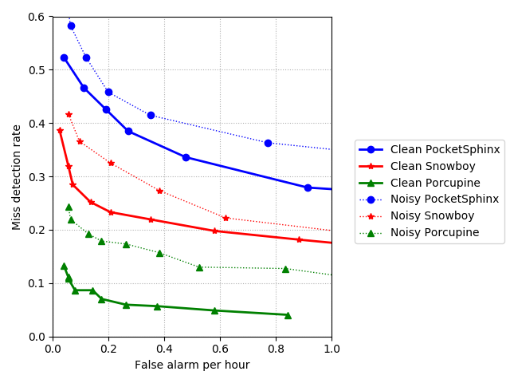
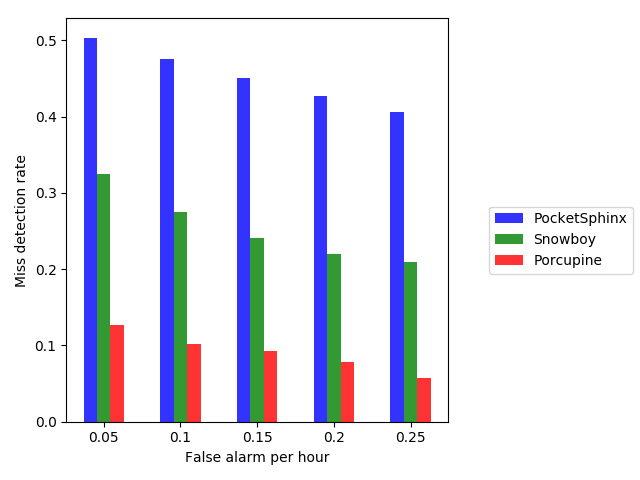
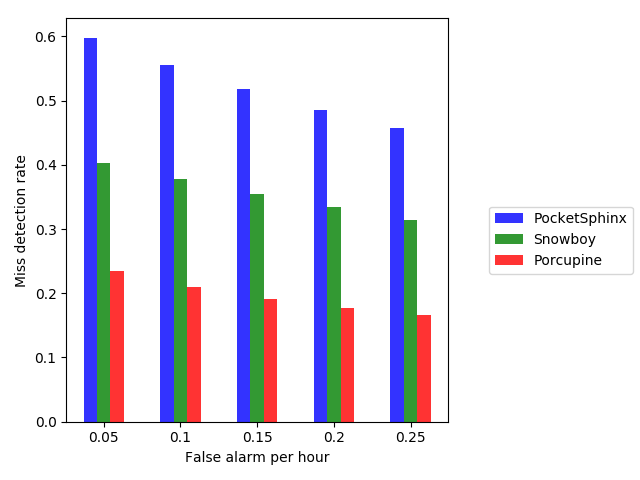

# Wakeword-benchmark &nbsp; [](https://twitter.com/intent/tweet?text=Performance%20comparison%20of%20different%20wakeword%20engines%20for%20Alexa&url=https://github.com/Picovoice/wakeword-benchmark&hashtags=wake-word,voice,AI,Alexa)

[](https://github.com/Picovoice/wakeword-benchmark/blob/master/LICENSE)

The primary purpose of this benchmark framework is to provide a scientific comparison between different wake-word
detection engines in terms of accuracy and runtime metrics. Currently, the framework
is configured for **Alexa** as the test wake-word. But it can be configured for any other wake-words as described [here](#how-can-i-reproduce-the-results).

# Why did we make this?

The benchmark framework provides a definitive answer to the question
"which engine provides the best performance for a given wake-word?". While working on
[Porcupine](https://github.com/Picovoice/Porcupine) we noted that there is a need for such tool to empower customers to make
data-driven decisions. The framework

- uses hundreds of crowd-sourced utterances of wake-word.
- uses tens of hours of data made publicly available by [Common Voice](https://voice.mozilla.org/en) as background model
(i.e. what is not the wake-work and needs to be ignored).
- allows simulating real-world conditions by adding noise to clean speech.
- runs wake-word engines at different detection thresholds (aka sensitivities) which results in different
miss detection and false alarm rates. Finally, it creates an
[ROC](https://en.wikipedia.org/wiki/Receiver_operating_characteristic) curve for each engine.
- measures [real time factor](http://enacademic.com/dic.nsf/enwiki/3796485), CPU usage, and memory usage for each engine on Raspberry Pi 3.
# Data

[Common Voice](https://voice.mozilla.org/en) is used as background dataset, i.e., dataset without utterances of the
wake-word. It can be downloaded from [here](https://voice.mozilla.org/en/data). Only recordings with at least two up-votes
and no down-votes are used (this reduces the size of the dataset to ~125 hours).

Furthermore, 369 recording of word Alexa from 89 distinct speakers are used. The recordings are crowd-sourced using an
Android mobile application. The recordings can be downloaded [here](https://www.kaggle.com/aanhari/alexa-dataset).

In order to closely simulate real-world situations, the data is mixed with noise. For this purpose, we use
[DEMAND](https://asa.scitation.org/doi/abs/10.1121/1.4799597) dataset which has noise recording in 18 different
environments (e.g. kitchen, office, traffic, etc.). It can be downloaded from
[here](https://www.kaggle.com/aanhari/demand-dataset).

# Wake-word engines

Three wake-word engines are used in this benchmark. [PocketSphinx](https://github.com/cmusphinx/pocketsphinx) which can
be installed using [PyPI](https://pypi.org/project/pocketsphinx/). [Porcupine](https://github.com/Picovoice/Porcupine)
and [Snowboy](https://github.com/Kitt-AI/snowboy) which are included as submodules in this repository. 

# Metric

We measure the accuracy of the wake-word engines using false alarm per hour and miss detection rates. The false alarm
per hour is measured as a number of false positives in an hour. Miss detection is measured as the percentage of wake-word
 utterances an engine rejects incorrectly. Using these definitions we compare the engines for a given false alarm, and therefore the
engine with a smaller miss detection rate has a better performance.

Two runtime metrics are measured, real time factor and memory usage. Real time factor is computed by dividing the length of input audio to
to the processing time. It can be thought of as inverse CPU usage. The engine with a higher real time factor is more computationally
efficient (faster).

# Usage

### Prerequisites

The benchmark has been developed on Ubuntu 16.04 with Python 3.5. It should be possible to run it on a Mac machine
or different distributions of Linux but has not been tested. Clone the repository using

```bash
git clone --recurse-submodules git@github.com:Picovoice/wakeword-benchmark.git
```

Install SoX for Ubuntu using
```
sudo apt-get install sox
```

Make sure the Python packages in the [requirements.txt](/requirements.txt) are properly installed for your Python version.
Then install the mp3 handler for SoX

```bash
sudo apt-get install libsox-fmt-mp3
```

Python bindings are used for running Porcupine and Snowboy. The repositories for these are cloned in [engines](/engines).
Make sure to follow the instructions on their repositories to be able to run their Python demo before proceeding to the next step.

For memory profiling [valgrind](http://valgrind.org/) is used. It can be installed using

```bash
sudo apt-get install valgrind
```

### Running the accuracy benchmark

Usage information can be retrieved via

```bash
python benchmark.py -h
```

The benchmark can be run using the following command from the root directory of the repository

```bash
python benchmark.py --common_voice_directory <root directory of Common Voice dataset> --alexa_directory <root directory of Alexa dataset> \
--demand_directory <root directory of Demand dataset>
```

This runs the benchmark for a clean environment and creates the ROC curves for different engines. When
`--output_directory <output directory to save the results>` is passed to command line the framework 
saves the results in CSV format. This is going to take a while (it takes 48 hours on a quad-core Intel machine).

To run the benchmark in the noisy environment pass the `--add_noise`. Noise is mixed into the audio samples with the SNR of 10dB which
simulates environments with moderate noise.

### Running the runtime benchmark

Please refer to runtime [documentation](/runtime/README.md).

# Results

## Accuracy

Below is the result (ROC curve) of running the benchmark framework for clean and noisy environments. As expected, for a
given false alarm rate the miss rate increases across different engines when noise is added to data.



A more illustrative way of comparing the results is to compare the miss rates given a fixed false alarm per hour value. The
engine with smallest miss rate is performing the best. This is shown below for clean speech scenario



Also below is the result in presence of noise



## Runtime

Below are the runtime measurements (on Raspberry Pi 3). Two metrics are measured (1) real time factor and (2) memory usage.
Fir ease of interpretation we also added average CPU usage by simply inversing the real time factor.

Engine | Real Time Factor | Average CPU Usage | Memory Usage
:---: | :---: | :---: | :---:
PocketSphinx | 3.15 | 31.75% | 15.58 MB
Snowboy | 5.28 | 18.94% | 2.43 MB
Porcupine | 13.53 | 7.39% | 1.38 MB
Porcupine Tiny | 29.28 | 3.42% | 0.24  MB

# FAQ

### How can I reproduce the results?

The results presented above are completely reproducible given that exactly same datasets and engines are used. 

Datasets are taken from
* [Common Voice Dataset](https://voice.mozilla.org/en/data) is an active project and evolving over time. But this should
not significantly affect the results.
* [Alexa Dataset](https://www.kaggle.com/aanhari/alexa-dataset).
* [Demand Dataset](https://www.kaggle.com/aanhari/demand-dataset).

The engines used in the benchmark are:
* PocketSphinx 0.1.3 from [PyPI](https://pypi.org/project/pocketsphinx/).
* Snowboy is cloned from its repository on [commit](https://github.com/Kitt-AI/snowboy/commit/d51c2e25c3bc3a44e06e1b16c6fdd44d9625f13c).
* Porcupine is cloned from its repository on [commit](https://github.com/Picovoice/Porcupine/commit/9b44c22e301e11556a4087d3655d7f1e7b8f8061).

### How can I use the framework for my wake-word?

The framework is currently configured for Alexa as the wake-word. It can be configured for a different wake-word by
following steps below

1. Collect recordings of your wake-word with the sample rate of 16000 in WAV format.
2. Implement `Dataset` interface for the new collection of wake-word recordings.
3. Instantiate the newly-created dataset instead of `AlexaDataset`.
4. Instantiate `CommonVoiceDataset` with `exclude_words` constructor parameter set to the new test word.
3. Assure all wake-word engines have a model for the newly-selected wake-word. Refer to the [engine.py](/engine.py) and
add your models to the engines.
