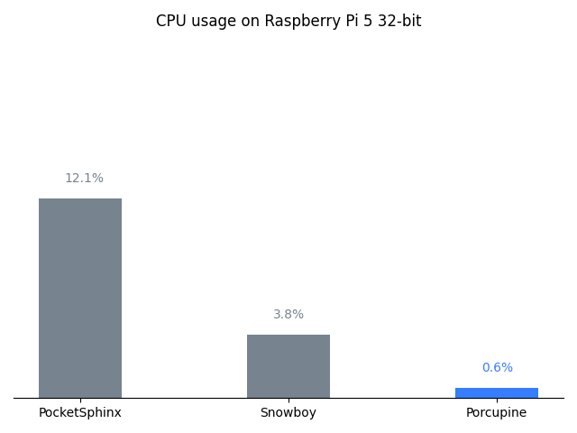

# Wake Word Benchmark

[](https://github.com/Picovoice/wakeword-benchmark/blob/master/LICENSE)

Made in Vancouver, Canada by [Picovoice](https://picovoice.ai)

The purpose of this benchmarking framework is to provide a scientific comparison between different wake word detection
engines in terms of accuracy and runtime metrics. While working on [Porcupine](https://github.com/Picovoice/Porcupine)
we noted that there is a need for such a tool to empower customers to make data-driven decisions.

## Table of Contents
- [Wake Word Benchmark](#wake-word-benchmark)
  - [Table of Contents](#table-of-contents)
  - [Results](#results)
    - [Accuracy](#accuracy)
    - [Runtime](#runtime)
  - [Data](#data)
  - [Engines](#engines)
  - [How to Reproduce?](#how-to-reproduce)

## Results

### Accuracy

Below is the result of running the benchmark framework averaged on six different keywords. The plot below shows the miss
rate of different engines at 1 false alarm per 10 hours. The lower the miss rate the more accurate the engine is.


### Runtime

Below is the runtime measurements on a Raspberry Pi 3. For Snowboy the runtime highly-depends on the keyword. Therefore,
we measured the CPU usage for each keyword and used the average.



## Data

[LibriSpeech](http://www.openslr.org/12/) (test_clean portion) is used as background dataset. It can be downloaded
from [OpenSLR](http://www.openslr.org/resources/12/test-clean.tar.gz).

Furthermore, more than 300 recordings of six keywords (alexa, computer, jarvis, smart mirror, snowboy, and view glass)
from more than 50 distinct speakers are used. The recordings are crowd-sourced. The recordings are stored within the
repository [here](audio).

In order to simulate real-world situations, the data is mixed with noise (at 10 dB SNR). For this purpose, we use
[DEMAND](https://doi.org/10.1121/1.4799597) dataset which has noise recording in 18 different environments
(e.g. kitchen, office, traffic, etc.). It can be downloaded
from [Kaggle](https://www.kaggle.com/aanhari/demand-dataset).

## Engines

Three wake-word engines are used. [PocketSphinx](https://github.com/cmusphinx/pocketsphinx) and
[Porcupine](https://github.com/Picovoice/Porcupine) are available on PyPI:
[PocketSphinx](https://pypi.org/project/pocketsphinx/) and [Porcupine](https://pypi.org/project/pvporcupine/).
[Snowboy](https://github.com/Kitt-AI/snowboy) which is included as submodules in this repository. The Snowboy
engine has an audio frontend component which is not normally a part of wake word engines and is considered a
separate part of audio processing chain. The other two engines have not such component in them. We enabled this
component in Snowboy engine for this benchmark as this is the optimal way of running it.

## How to Reproduce?

### Prerequisites

The benchmark has been developed on Ubuntu 20.04 with Python 3.8. Clone the repository using

```console
git clone --recurse-submodules git@github.com:Picovoice/wakeword-benchmark.git
```

Make sure the Python packages in the [requirements.txt](requirements.txt) are properly installed for your Python
version as Python bindings are used for running the engines. The repository for Snowboy is cloned in
[engines](engines). Follow the instructions on their repository to be able to run their Python demo before proceeding
to the next step.

### Running the Accuracy Benchmark

Usage information can be retrieved via

```console
python3 benchmark.py -h
```

The benchmark can be run using the following command from the root of the repository

```console
python3 benchmark.py \
--librispeech_dataset_path ${LIBRISPEECH_DATASET_PATH} \
--demand_dataset_path ${DEMAND_DATASET_PATH} \
--keyword ${KEYWORD} \
--access-key ${ACCESS_KEY}
```

### Running the Runtime Benchmark

Refer to runtime [documentation](runtime/README.md).
